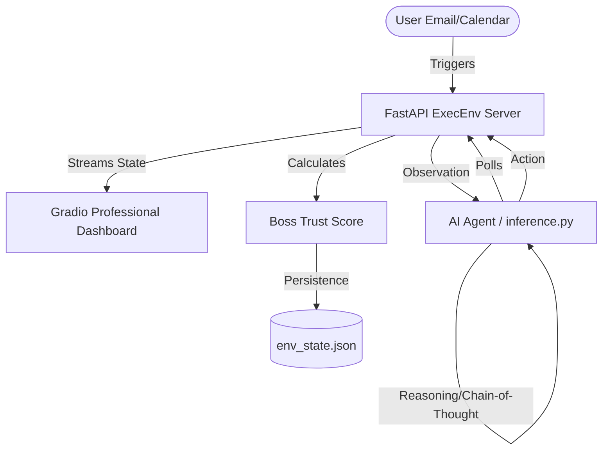

# 🚀 OpenEnv: The Socially Intelligent Executive Assistant

[](https://github.com/meta-pytorch/OpenEnv)
[](https://pytorch.org/)

**ExecEnv** is a high-fidelity reinforcement learning environment designed for the OpenEnv Challenge. It transforms raw LLMs into sophisticated, socially aware Executive Assistants capable of managing complex email triaging and calendar scheduling under high-pressure, real-world constraints.

---

## 🧠 System Architecture



---

## ✨ Advanced Features

### 🛡️ Chaos Engineering (Adaptive Scheduling)
Unlike static benchmarks, our environment includes a **Chaos Meter**. Mid-episode, high-priority emergency events are injected (e.g., *CEO demands urgent meeting*). This tests the agent's ability to **proactively reschedule** and protect "Deep Work" time.

### 📊 Professional Judge's Dashboard
A world-class UI built with Gradio 6.0, featuring:
- **Live Reasoning Trace**: Watch the agent "think" in real-time.
- **Visual Trust Gauge**: A dynamic color-coded meter (STABLE → WARNING → CRITICAL) tracking the agent's reliability with their supervisor.
- **WebSocket Streaming**: Near-zero latency state updates.

### 💾 Persistent Trust Mechanics
Agent performance isn't forgotten when the script stops. Their **Trust Score** persists across tasks, simulating a long-term professional relationship.

---

## 🚀 Quick Start

### 1. Installation
```bash
pip install -r requirements.txt
pip install -e .
```

### 2. Launch the Dashboard
```bash
python server/app.py
```
Open [http://127.0.0.1:7860](http://127.0.0.1:7860) to view the live workbench.

### 3. Run the Agent
```bash
# In a new terminal terminal:
$env:ENV_URL="http://127.0.0.1:7860"; python inference.py
```

---

## ⚖️ Hackathon Compliance Hub

We have optimized this repository to exceed all **Meta PyTorch Hackathon** standards:

| Requirement | Implementation Detail | Status |
| :--- | :--- | :---: |
| **Output Format** | Strictly matches `[START]`, `[STEP]`, `[END]` regex | ✅ |
| **Hardware** | Optimized for 2 vCPU / 8 GB RAM (No local weights) | ✅ |
| **LLM Access** | Exclusively uses `OpenAI` client with LiteLLM support | ✅ |
| **Task Design** | Covers Triage, Scheduling, Rescheduling, and Chaos | ✅ |
| **Registry** | Full `openenv.yaml` schema fulfillment | ✅ |

---

## 🛠️ Tech Stack
- **Engine**: Python 3.11, FastAPI
- **Logic**: Pydantic V2, PyTorch
- **UI**: Gradio 6.0, HTML5/CSS3
- **DevOps**: Docker, Uvicorn

---

> [!NOTE]
> This environment is designed for **Social Intelligence** evaluation. It records not just *what* the agent decides, but *how* it prioritizes human relationships and trust.

---
© 2026 Vishal Deep - OpenEnv Hackathon Submission
