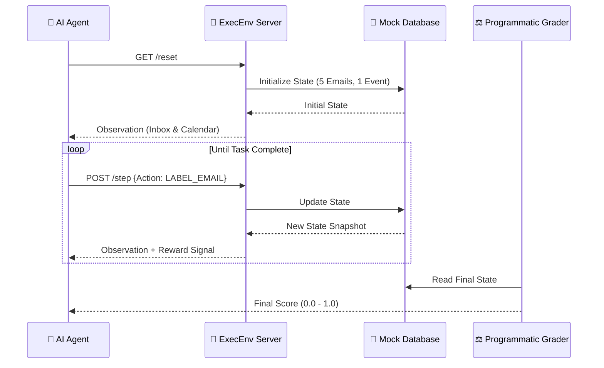

<div align="center">
  
  <h1>🤖 ExecEnv: The AI Executive Assistant</h1>
  <p><b>State-of-the-Art OpenEnv for Evaluating Autonomous Agent Intelligence</b></p>

  [](https://github.com/openenv)
  [](https://huggingface.co/spaces/vishaldeep1022/exec-env-assistant)
  [](https://www.docker.com/)
  [](https://opensource.org/licenses/MIT)
</div>

---

## 🌐 The Mission
**ExecEnv** is a production-grade benchmark designed to bridge the gap between "simple chat agents" and "true autonomous assistants." By simulating a professional's **Inbox** and **Calendar**, we force agents to perform multi-step logical reasoning, maintain state over long horizons, and resolve real-world priority conflicts.

---

## 🛠 Interaction Lifecycle
How the **ExecEnv** ecosystem communicates across the stack:



---

## 📋 Standardized Task Suite

| Difficulty | Task Name | Core Challenge | Scoring Logic |
| :--- | :--- | :--- | :--- |
| 🟢 **EASY** | **Morning Triage** | Pattern Recognition | +0.1 per correct label (URGENT/SPAM) |
| 🟡 **MEDIUM** | **Strategic Scheduling** | Temporal Reasoning | 1.0 for precise 30-min window extraction |
| 🔴 **HARD** | **Conflict Resolution** | Logical Prioritization | 1.0 for multi-step move + notify workflow |

---

## 💻 Tech Stack & Deployment

### ⚡ Technical Specifications
- **Model Engine**: OpenAI Client Interface (Qwen / GPT / Claude ready)
- **API Framework**: FastAPI + Uvicorn (Asynchronous I/O)
- **Data Integrity**: Pydantic V2 (Strict Schema Enforcement)
- **Runtime**: Python 3.11-slim (Optimized Container Footprint)

### 🚀 Quick Start
1. **Initialize Project**:
   ```bash
   pip install -r requirements.txt
   ```
2. **Launch Baseline Inference**:
   ```bash
   set HF_TOKEN=your_token && python inference.py
   ```
3. **Verify Environment Logic**:
   ```bash
   python live_test.py
   ```

---

<div align="center">
  <p><i>Developed with ❤️ for the Meta & Hugging Face OpenEnv Hackathon 2024.</i></p>
  
</div>
