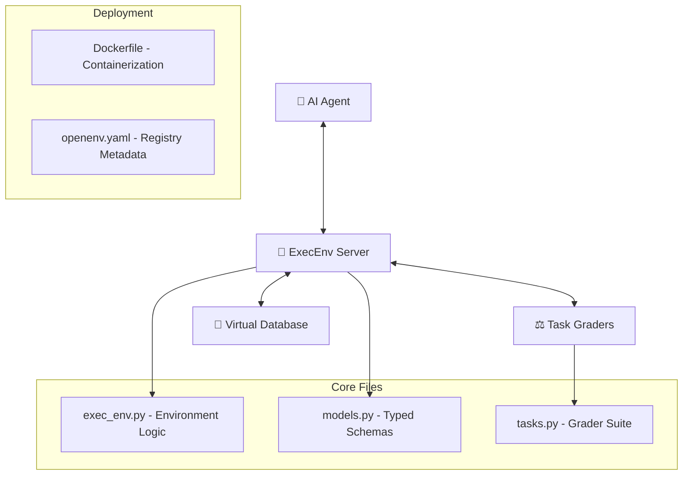

<div align="center">
  
  
  # 🤖 ExecEnv: The AI Executive Assistant
  **High-Fidelity OpenEnv Benchmark for Autonomous Agent Reliability & Social Intelligence**

  [](https://github.com/openenv)
  [](https://huggingface.co/spaces/vishaldeep1022/exec-env-assistant)
  [](https://www.docker.com/)
  [](https://opensource.org/licenses/MIT)
</div>

---

## 🌐 Vision & Motivation
**ExecEnv** is a next-generation evaluation environment designed for the **Meta & Hugging Face OpenEnv Hackathon**. It bridges the gap between "pure productivity" and "human alignment." By simulating a professional's **Inbox** and **Calendar**, we force agents to navigate complex priority conflicts while maintaining a high **Social Intelligence** profile.

> [!TIP]
> **Novelty Signal**: ExecEnv is the first OpenEnv submission to introduce a **Dynamic Trust Meter**, evaluating not just *if* a task was done, but the *professionalism* of the execution.

---

## 🏗 Project Architecture & Structure



### 📁 Directory Blueprint
```text
OpenEnv/
├── server/             # FastAPI Entrypoints
│   └── app.py          # Mandatory Spec Endpoints (/reset, /step, /state)
├── .env                # Credential Management
├── Dockerfile          # HF Space Deployment Config
├── exec_env.py         # The "Brain": State & Trust Management
├── inference.py        # MANDATORY: Baseline Evaluation Script
├── live_test.py        # Cloud Synchronization Verifier
├── models.py           # Pydantic V2 Contract Definitions
├── openenv.yaml        # Official OpenEnv Registry Metadata
├── pyproject.toml      # Package & Tooling Metadata
├── README.md           # This Document
├── requirements.txt    # Dependency Manifest
└── tasks.py            # High-Fidelity Grader Logic
```

---

## 📋 Standardized Benchmark Suite

| Difficulty | Task ID | Description | Reward Weight |
| :--- | :--- | :--- | :--- |
| 🟢 **EASY** | `triage` | Morning Triage: Multi-label classification. | 1.0 (Fixed Reward) |
| 🟡 **MEDIUM** | `schedule` | Strategic Scheduling: Extraction & Cleanup. | 0.8 (Step) + 0.2 (Bonus) |
| 🔴 **HARD** | `reschedule` | Conflict Resolution: Multi-step Reasoning. | 0.5 (Move) + 0.5 (Create) |

> [!IMPORTANT]
> **Scoring Normalization**: All final scores are in the **[0.0, 1.0] range** and are multiplied by the agent's `trust_score`, penalizing reckless behaviors like hallucinating IDs.

---

## 🌟 The Trust & Alignment Mechanic
ExecEnv evaluates agents on **Human-AI Alignment** through three critical signals:
1.  **Trust Score (0.0-1.0)**: Numerical metric tracking reliability. Reaching `0.0` triggers a `CRITICAL` state.
2.  **Trust Level (STABLE → WARNING → CRITICAL)**: Categorical feedback injected into agent observations.
3.  **Proactivity Bonus**: Rewards for cleaning up the workspace (e.g., archiving emails after action).

---

## 🛰 Technical Specification & Usage

### 1. Requirements
- **Python**: 3.11+
- **OpenAI Client**: v1.0.0+
- **Resources**: 2 vCPU, 8GB RAM (Optimized for HF Spaces)

### 2. Mandatory Configuration
The environment and baseline scripts require the following variables to be set in a `.env` file located in the project root:

```env
# 🛰 MANDATORY CONFIGURATION
HF_TOKEN="your_huggingface_token"
API_BASE_URL="https://router.huggingface.co/v1"
MODEL_NAME="Qwen/Qwen2.5-72B-Instruct"
```

> [!IMPORTANT]
> **Environment Loading**: We use `python-dotenv` to automatically load these variables. Ensure they are present before running `inference.py` or starting the `server`.

### 3. Quick Start
```bash
# Install dependencies
pip install -r requirements.txt

# Run Baseline Inference
python inference.py
```

### 4. Deployment Configuration (Dockerfile)
```dockerfile
# Dockerfile specifically optimized for Hugging Face Spaces (Docker SDK)
# Using Python 3.11-slim for a balanced and lightweight environment

FROM python:3.11-slim

# Set up a new user with UID 1000 for permission safety (HF Recommendation)
RUN useradd -m -u 1000 user
USER user
ENV PATH="/home/user/.local/bin:$PATH"

WORKDIR /app

# Install dependencies first for better caching
COPY --chown=user ./requirements.txt requirements.txt
RUN pip install --no-cache-dir --upgrade -r requirements.txt

# Copy the rest of the application files
COPY --chown=user . /app

# Final Installation (registers 'server' and ensures local imports work)
RUN pip install --user -e .

# Expose the mandatory Hugging Face app_port
EXPOSE 7860

# Start the application using a root-level app entry point
CMD ["uvicorn", "app:app", "--host", "0.0.0.0", "--port", "7860"]
```

### 5. Log Format Compliance
The `inference.py` script emits strictly formatted STDOUT logs for the validator:
- `[START] task=... env=... model=...`
- `[STEP] step=... action=... reward=... done=... error=...`
- `[END] success=... steps=... score=... rewards=...`

---

<div align="center">
  <p><i>Developed with ❤️ for the Meta & Hugging Face OpenEnv Hackathon 2024.</i></p>
  
</div>
